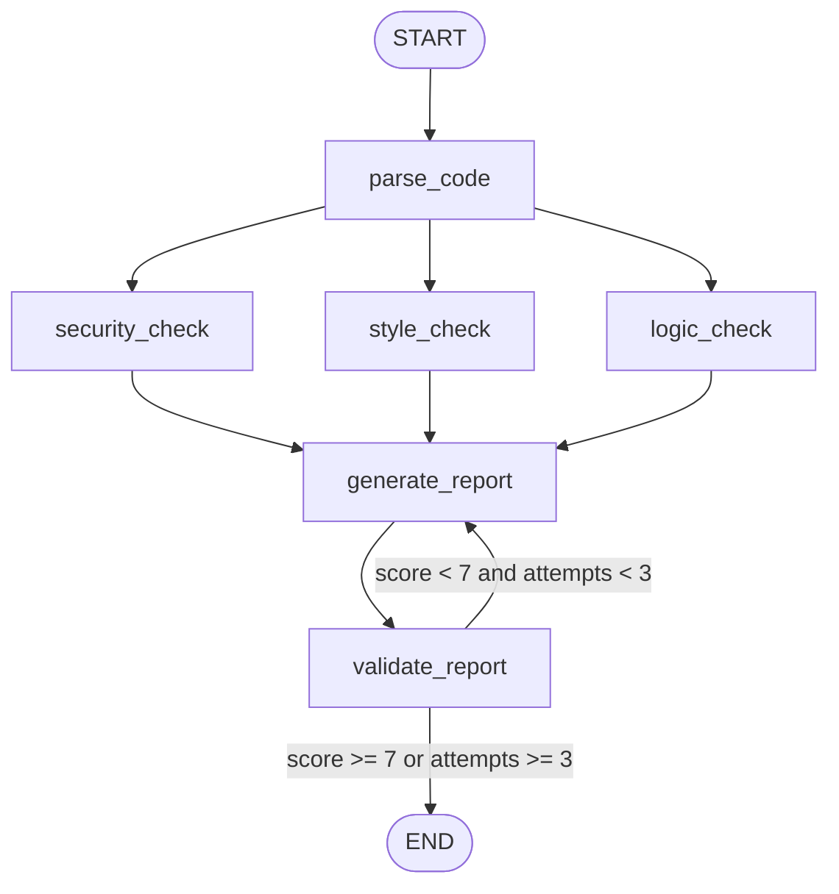

cat > README.md << 'EOF'
# 🔗 Graphector

**Мульти-агентный code review сервис на LangGraph с циклической валидацией качества**


Graphector принимает код, прогоняет его через три параллельных AI-агента (безопасность, стиль, логика), генерирует отчёт и **сам проверяет качество собственного отчёта**, перегенерируя его в цикле, если результат недостаточно хорош.

---

## 🎯 Зачем этот проект

Большинство демо-проектов с LLM делают линейный пайплайн: запрос → ответ. Graphector построен иначе — это **граф состояний** с параллельным выполнением, условным ветвлением и циклом обратной связи, что демонстрирует:

- Параллельную работу нескольких агентов над одной задачей
- Передачу и накопление состояния между узлами графа
- Самопроверку и автоматическую перегенерацию результата (self-correcting loop)
- Production-ready обвязку: кэширование, rate limiting, стриминг, Docker

---

## 🧠 Архитектура графа



**Узлы графа:**

| Узел | Роль |
|---|---|
| `parse_code` | Определяет язык программирования |
| `security_check` | Ищет уязвимости: SQL injection, секреты в коде, опасные функции |
| `style_check` | Проверяет стиль: именование, дублирование, magic numbers |
| `logic_check` | Ищет логические ошибки: сложность, обработку ошибок, утечки |
| `generate_report` | Собирает все находки в единый структурированный отчёт |
| `validate_report` | Оценивает качество отчёта 0–10 и решает: вернуть в `generate_report` или завершить |

---

## ⚙️ Стек

- **LangGraph** — оркестрация мульти-агентного графа
- **Google Gemini API** (`gemini-2.5-flash`) — LLM для анализа кода
- **FastAPI** — REST API + Server-Sent Events для live-прогресса
- **aiogram 3** — Telegram-бот интерфейс
- **Redis** — кэширование результатов по хэшу кода
- **slowapi** — rate limiting (5 запросов/мин с IP)
- **Docker / Docker Compose** — контейнеризация, деплой на Amvera

---

## 🚀 Быстрый старт

### Через Docker (рекомендуется)

```bash
git clone https://github.com/yanisletum/graphector.git
cd graphector
cp .env.example .env
# заполни GEMINI_API_KEY и TELEGRAM_BOT_TOKEN в .env

docker compose up --build
```

API будет доступен на `http://localhost:8010/docs`

> Если порт 8010 у тебя занят другим сервисом, поменяй его в трёх местах: `app/main.py` (параметр `port=`), `Dockerfile` (`EXPOSE`) и `docker-compose.yml` (секция `ports`).

### Локально (WSL2 / Linux)

```bash
python3 -m venv venv
source venv/bin/activate
pip install -r requirements.txt

# Redis нужен локально
sudo apt install -y redis-server
redis-server --daemonize yes

cp .env.example .env
# заполни ключи

python -m app.main
```

---

## 📡 API

### `POST /api/v1/review`

```bash
curl -X POST http://localhost:8010/api/v1/review \
  -H "Content-Type: application/json" \
  -d '{
    "code": "def get_user(id):\n    query = f\"SELECT * FROM users WHERE id={id}\"\n    return db.execute(query)"
  }'
```

Реальный ответ сервиса:

```json
{
  "language": "python",
  "issues": {
    "security": [
      "- SQL injection vulnerability: the id parameter is directly interpolated into the SQL query using an f-string."
    ],
    "style": [
      "- Отсутствие docstring у функции get_user.",
      "- Параметр id затеняет встроенный тип id."
    ],
    "logic": [
      "- Отсутствие обработки ошибок при работе с БД.",
      "- Нет валидации типа входного параметра id."
    ]
  },
  "report": "## Отчёт о Code Review ...",
  "quality_score": 10,
  "attempts": 1,
  "total_issues": 5,
  "from_cache": false
}
```

### `GET /api/v1/review/stream?code=...`

Server-Sent Events — прогресс выполнения графа в реальном времени, узел за узлом.

### `GET /api/v1/health`

Health-check для Docker / Amvera.

---

## 🤖 Telegram-бот

Запускается автоматически вместе с FastAPI (через `lifespan`). Просто отправь код сообщением — бот вернёт структурированный отчёт.

---

## 📂 Структура проекта
graphector/ 

├── app/ 

│ ├── Graph/ 

│ │ ├── state.py # ReviewState — состояние графа 

│ │ ├── nodes.py # узлы: parse, проверка безопасности/стиля/логики, отчет, валидация 

│ │ ├── router.py # условная логика циклов 

│ │ └── builder.py # сборка StateGraph 

│ ├── bot/ 

│ │ └── handlers.py # обработчики айограмм 

│ ├── api/ 

│ │ ├── Schemas.py # Pydantic модели 

│ │ └── маршруты.py # Конечные точки FastAPI 

│ ├── кэш.py # Redis кэш по коду SHA256 

│ ├── limiter.py # ограничение скорости 

│ └── main.py # точка получения: FastAPI + бот вместе 

├── Dockerfile 

├── docker-compose.yml 

└── требования.txt

---

## 🛣️ Roadmap

- [ ] Поддержка diff-режима (review только изменённых строк PR)
- [ ] GitHub Action для автоматического ревью pull request'ов
- [ ] Веб-интерфейс с live-прогрессом через SSE
- [ ] Поддержка локальных моделей через Ollama как fallback

---

## 📄 Лицензия

MIT
EOF
echo "README обновлён"
